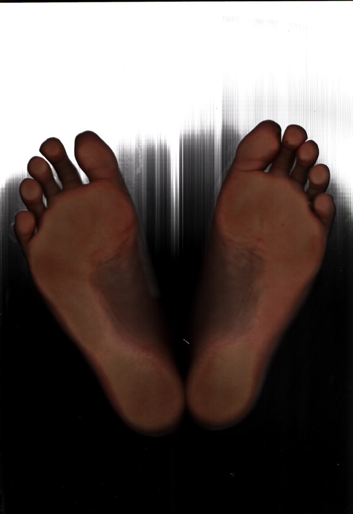
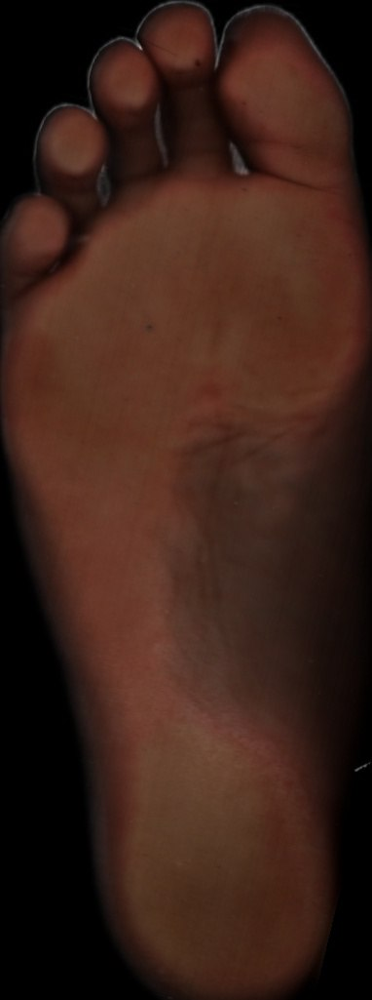
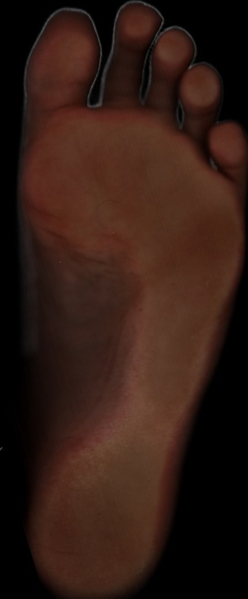
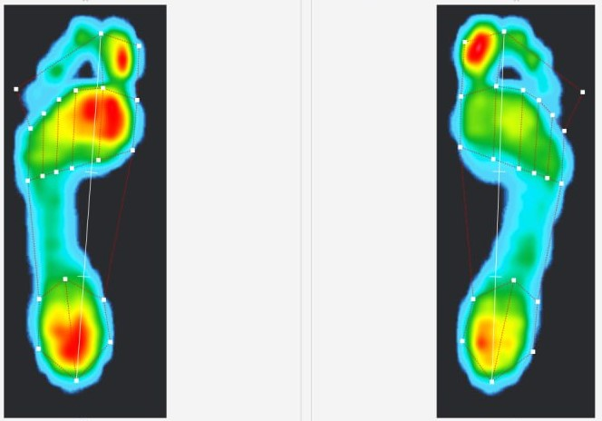
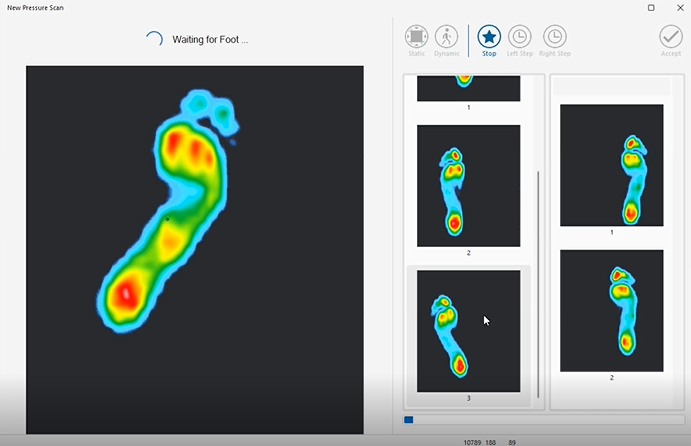

# Plantar Scan Image Processing System

## Overview

Medical image processing system developed for foot assessment and custom orthopedic insole design.

The software processes plantar scans and extracts useful information for clinical evaluation and manufacturing workflows.

---

## Responsibilities

- Developed image processing algorithms
- Implemented automatic image alignment
- Designed foot segmentation procedures
- Improved image quality and noise reduction
- Developed left/right foot detection workflows

---

## Technologies

- Python
- OpenCV
- Medical Imaging
- Image Processing

---

## Key Features

- Automatic scan alignment and Noise reduction
 Raw Scanned Image:

Rotated and Denoised Foot: 

Rotated and Denoised Right foot: 

- Foot segmentation 

- Left/right foot identification 

- Measurement extraction

---

## Application Areas

- Orthotics
- Podiatry
- Foot assessment
- Medical insole production

---

## Project Type

Industrial Medical Device Software Project

*Note: Source code is not publicly available due to intellectual property and company confidentiality policies.*
